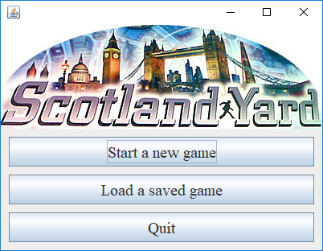
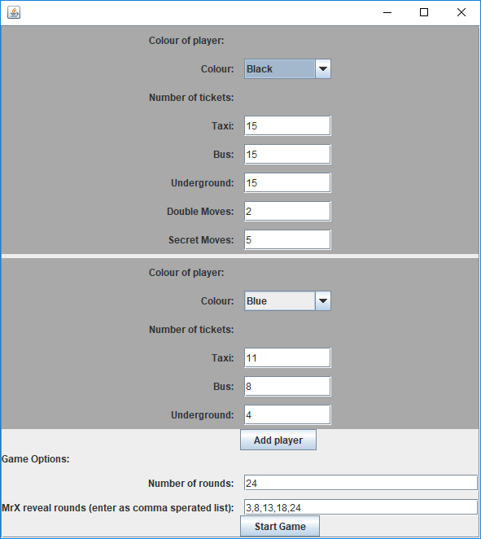
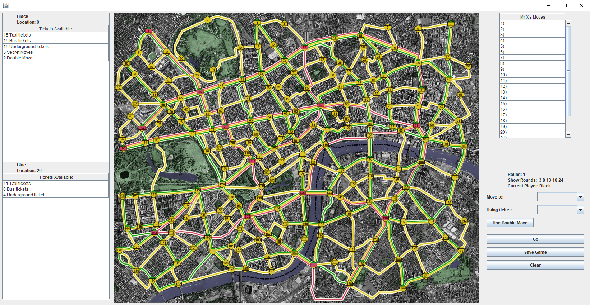

# Scotland Yard A

See [scotlandyardb](<https://github.com/dkeitley/scotlandyardB>) for a more complete version of this project, which includes modules for playing across a network and against AI players. 

This repository contains source code for a computer game adaptation of the board game,  [Scotland Yard](https://en.wikipedia.org/wiki/Scotland_Yard_(board_game)) , completed as part of a programming assignment at the University of Bristol.  A description of the rules for Scotland Yard can be found [here](resources/Scotland_Yard_Rules.pdf). 


## Playing the game...

The application is launched by running the jar executable which opens the main menu. 

```
java -jar bin\jar\scotlandyard.jar
```





Starting a new game will open an options menu allowing you to configure aspects of the game such as the number of players, the number of rounds, the number of each ticket type and so on. 




Once the game is started, the main game window shows the Scotland Yard board with panels on the left and right displaying information about each turn.  As moves are played the GUI updates to display information relevant to the current player. 

Saving a game exports the game state to a gameSave.txt file, which can be loaded by the application through the start menu. 





